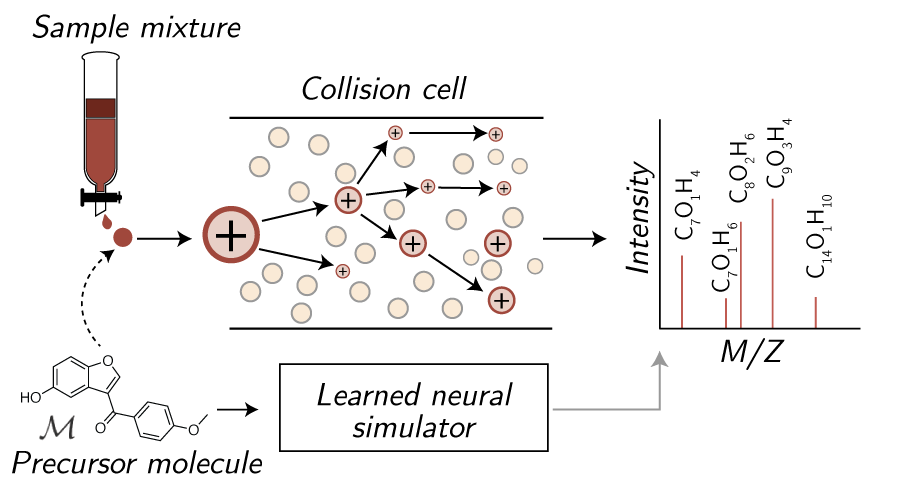

#  Mass Spectrum Predictor

This repository contains implementations for the following spectrum simulator models predicting molecular tandem mass spectra from molecules: 


- ️️️️ ❄️ ICEBER️️G ❄️: [Inferring CID by Estimating Breakage Events and Reconstructing their Graphs](http://arxiv.org/abs/2304.13136) (now available to run through [GNPS2](https://gnps2.org/))
- 🧣 SCARF 🧣: [Subformula Classification for Autoregressively Reconstructing Fragmentations](https://arxiv.org/abs/2303.06470),

ICEBERG predicts spectra at the level of molecular fragments, whereas SCARF predicts spectra at the level of chemical formula. In order to fairly compare various spectra models, we implement a number of baselines and alternative models using equivalent settings across models (i.e., same covariates, hyeprparmaeter sweeps for each, etc.):
 
1. *NEIMS* using both FFN and GNN encoders from [Rapid prediction of electron–ionization mass spectrometry using neural networks](https://pubs.acs.org/doi/full/10.1021/acscentsci.9b00085)    
2. *MassFormer* from [MassFormer: Tandem Mass Spectrum Prediction for Small Molecules using Graph Transformers](https://arxiv.org/abs/2111.04824)  
3. *3DMolMS* from [3DMolMS: Prediction of Tandem Mass Spectra from Three Dimensional Molecular Conformations](https://www.biorxiv.org/content/10.1101/2023.03.15.532823v1)  
4. *GRAFF-MS* from [Efficiently predicting high resolution mass spectra with graph neural networks](https://arxiv.org/pdf/2301.11419.pdf)
5. *CFM-ID* from [CFM-ID 4.0: More Accurate ESI-MS/MS Spectral Prediction and Compound Identification](https://pubs.acs.org/doi/10.1021/acs.analchem.1c01465) (not retrained; instructions for running are provided)


Contributors: Sam Goldman, John Bradshaw, Janet Li, Jiayi Xin, Connor W. Coley




## Contents


1. [Install](#setup)  
2. [Quickstart](#quickstart)  
3. [Data](#data)  
4. [Experiments](#experiments)    
5. [Analysis](#analysis)    
6. [Augmentation](#augmentation)    
7. [Citation](#citation)    


## Install & setup <a name="setup"></a>

Install and set up the conda environment using [mamba](https://mamba.readthedocs.io/en/latest/):

```
mamba env create -f environment.yml
mamba activate ms-gen
pip install -r requirements.txt
python3 setup.py develop
```
Note: if you are using GPU, please uncomment the CUDA-based packages for DGL and comment the CPU package in ``envorinment.yaml``.


## Quickstart <a name="quickstart"></a>

To make predictions, we have released and made public a version of SCARF and ICEBERG both trained upon the CANOPUS dataset (renamed NPLIB1 for clarity in corresponding manuscripts). This can be downloaded and used to predict a set of 100 sample molecules contained in the NIST library, as included at `data/spec_datasets/sample_labels.tsv` (test set):

 
```
# Scarf quickstart
. quickstart/scarf/download_model.sh
. quickstart/scarf/run_model.sh

# Iceberg quickstart
. quickstart/iceberg/download_model.sh
. quickstart/iceberg/run_model.sh
```

Model outputs will be contained in `quickstart/{model}/out/`. **We note that this model may be less performant than the model trained on the commercial NIST20 Library. Download links to models trained on NIST20 models are available upon request to any users with a NIST license.**  ICEBERG assigns intensities to various fragment masses. Refer to `notebooks/scarf_demo.ipynb` and `notebooks/iceberg_demo.ipynb` for a walkthrough on how to process and interpret the output dictionary.

Please note models have been updated since the original release to correct for a small error in the adduct masses for `[M-H2O+H]+` and should be re-downloaded.


## Data <a name="data"></a>

A data subset from the GNPS database including processed dag annotations (magma\_outputs/), subformulae (subformulae/), retrieval databases (retrieval/), splits (splits/), and spectra files (spec\_files/) can be downloaded into ``data/spec_datasets/canopus_train_public``. Note CANOPUS is an earlier name of the GNPS dataset, as explained in our ICEBERG paper.

```
. data_scripts/download_gnps.sh
```

For those interested in understanding the full dataset processing pipeline, we refer you to `data_scripts/`. This contains functinoalities for generating assignment DAGs (i.e., iceberg training), assigning subformulae to spectra (i.e., scarf training + evaluation), and pubchem dataset creation (i.e., for retrieval experiments). We explain some of these details below.

``nist20`` is a commercial dataset. Many of the scripts and pipelines include commands to run / train models on NIST20 as well; we suggest commenting these out where applicable.


### SCARF Processing

Data should then be assigned to subformulae files using
`data_scripts/forms/assign_subformulae.py`, which will preprocess the data. We
produce two fragment versions of the molecule, `magma_subform_50` and
`no_subform`. The former strictly labels subformula based upon smiles structure
and the latter is permissive and allows all entries to pass. The following
script does this for both `canopus_train_public` and `nist20` if it has been
acquired and parsed (commercial dataset).

```
. data_scripts/all_assign_subform.sh
```


### ICEBERG Processing

In addition to building processed subformulae, to train ICEBERG, we must
annotate substructures and create a labeled dataset over the breakage process, 
which we do with the MAGMa algorithm.

This can be done with the following script, specifying an appropriate dataset:

```

. data_scripts/dag/run_magma.sh

```


### Retrieval

To conduct retrieval experiments, libraries of smiles must be created. A PubChem
library is converted and each chemical formula is mapped to (smiles, inchikey)
pairs. Subsets are selected for evaluation.  Making formula subsets takes longer
(on the order of several hours, even parallelized) as it requires converting
each molecule in pubchem to a mol / InChi. 

```

source data_scripts/pubchem/01_download_smiles.sh
python data_scripts/pubchem/02_make_formula_subsets.py
python data_scripts/pubchem/03_dataset_subset.py --dataset-labels data/spec_datasets/nist20/labels.tsv # for nist20 dataset
python data_scripts/pubchem/04_make_retrieval_lists.py

```

Processed tables are already included inside `canopus_train_public`.


 
## Experiments <a name="experiments"></a>


### SCARF

SCARF models trained in two parts: a prefix tree generator and an intensity predictor. The pipeline for training and evaluating this model can be accessed in `run_scripts/scarf_model/`. The internal pipeline used to conduct experiments can be followed below:

1. *Train scarf model*: `run_scripts/scarf_model/01_run_scarf_gen_train.sh`
2. *Sweep number of prefixes to generate*: `run_scripts/scarf_model/02_sweep_scarf_gen_thresh.py`  
3. *Use model 1 to predict model 2 training set*: `run_scripts/scarf_model/03_scarf_gen_predict.sh`   
4. *Train intensity model*: `run_scripts/scarf_model/04_train_scarf_inten.sh`
5. *Make and evaluate intensity predictions*: `run_scripts/scarf_model/05_predict_form_inten.py`
6. *Run retrieval*: `run_scripts/scarf_model/06_run_retrieval.py`  
7. *Time scarf*: `run_scripts/scarf_model/07_time_scarf.py`  
8. *Export scarf forms* `run_scripts/scarf_model/08_export_forms.py`


Instead of running in batched pipeline model, individual gen training, inten
training, and predict calls can be  made using the following scripts respectively:

1. `python src/ms_pred/scarf_pred/train_gen.py`
2.  `python src/ms_pred/scarf_pred/train_inten.py`
3.  `python src/ms_pred/scarf_pred/predict_smis.py`

An additional notebook showcasing how to individually load models and make predictions can be found at `notebooks/scarf_demo.ipynb`. 

We provide scripts showing how we conducted hyperparameter optimization as
well:

1. *Hyperopt scarf model*: `run_scripts/scarf_model/hyperopt_01_scarf.sh`  
2. *Hyperopt scarf inten model*: `run_scripts/scarf_model/02_sweep_scarf_gen_thresh.py`  


### ICEBERG

ICEBRG models, like SCARF, are trained in two parts: a learned fragment generator and an intensity predictor. The pipeline for training and evaluating this model can be accessed in `run_scripts/dag_model/`. The internal pipeline used to conduct experiments can be followed below:

1. *Train dag model*: `run_scripts/dag_model/01_run_dag_gen_train.sh`   
2. *Sweep over the number of fragments to generate*: `run_scripts/dag_model/02_sweep_gen_thresh.py`     
3. *Use model 1 to predict model 2 training set*: `run_scripts/dag_model/03_run_dag_gen_predict.sh`   
4. *Train intensity model*: `run_scripts/dag_model/04_train_dag_inten.sh`   
5. *Make and evaluate intensity predictions*: `run_scripts/dag_model/05_predict_dag_inten.py`  
6. *Run retrieval*: `run_scripts/dag_model/06_run_retrieval.py`  
7. *Time iceberg*: `run_scripts/dag_model/07_time_dag.py`  
8. *Export dag predictions* `run_scripts/dag_model/08_export_preds.py`  


Instead of running in batched pipeline model, individual gen training, inten
training, and predict calls can be  made using the following scripts respectively:

1. `python src/ms_pred/dag_pred/train_gen.py`
2.  `python src/ms_pred/dag_pred/train_inten.py`
3.  `python src/ms_pred/dag_pred/predict_smis.py`

An additional notebook showcasing how to individually load models and make predictions can be found at `notebooks/iceberg_demo.ipynb`.

The models were hyperoptimized using the following scripts:  
1. `run_scripts/dag_model/hyperopt_01_dag.sh`   
2. `run_scripts/dag_model/hyperopt_02_inten.sh`  


### FFN Spec 

Experiment pipeline utilized:  
1. *Train models*: `run_scripts/ffn_model/01_run_ffn_train.sh`
2. *Predict and eval*: `run_scripts/ffn_model/02_predict_ffn.py`
3. *Retreival experiments*: `run_scripts/ffn_model/03_run_retrieval.py`
4. *Time ffn*: `run_scripts/ffn_model/04_time_ffn.py`

Hyperopt FFN: `run_scripts/ffn_model/hyperopt_01_ffn.sh`  


### Autoregressive baseline

Baseline used to show the effect of successively generating formula, rather
than decoding with SCARF. 

Experiment pipeline utilized:   
1. *Train models*: `run_scripts/autoregr_baseline/01_run_autoregr_train.sh`  
2. *Sweep model*: `run_scripts/autoregr_baseline/02_sweep_autoregr_thresh.py`  


Hyperparameter optimization: `run_scripts/autoregr_baseline/hyperopt_01_autoregr.sh`   

### GNN Spec 

Experiment pipeline:   

1. *Train models*: `run_scripts/gnn_model/01_run_gnn_train.sh`
2. *Predict and eval*: `run_scripts/gnn_model/02_predict_gnn.py`
3. *Retreival experiments*: `run_scripts/gnn_model/03_run_retrieval.py`
4. *Time gnn*: `run_scripts/gnn_model/04_time_gnn.py`

Hyperopt GNN:  `run_scripts/gnn_model/hyperopt_01_gnn.sh`


### Massformer

Experiment pipeline:     
1. *Train models*: `run_scripts/massformer_model/01_run_massformer_train.sh`  
2. *Predict and eval*: `run_scripts/massformer_model/02_predict_massformer.py`  
3. *Retreival experiments*: `run_scripts/massformer_model/03_run_retrieval.py`  
4. *Time massformer*: `run_scripts/massformer_model/04_time_massformer.py`   

Hyperopt Massformer: `run_scripts/massformer_model/hyperopt_01_massformer.sh`  


### 3DMolMS

We include a baseline implementation of 3DMolMS in which we utilize the same architecture as these authors. We note we do not include collision energy or machines as covariates for consistency with our other implemented models and data processing pipelines, which may affect performance. 

Experiment pipeline:   
1. *Train models*: `run_scripts/molnetms/01_run_ffn_train.sh`
2. *Predict and eval*: `run_scripts/molnetms/02_predict_ffn.py`
3. *Retreival experiments*: `run_scripts/molnetms/03_run_retrieval.py`
4. *Time 3d mol ms*: `run_scripts/molnetms/04_time_molnetms.py`

Hyperopt 3DMolMS:  `run_scripts/molnetms/hyperopt_01_molnetms.sh`


### GRAFF-MS 

We include a baseline variation of GRAFF-MS in which we utilize a fixed formula vocabulary. We note we do not include collision energy or machines as covariates for consistency with our other implemented models and data processing pipelines, which may affect performance. In addition, because our data does not contain isotopic or varied adduct formula labels, we replace the marginal peak loss with a cosine similarity loss. Pleases see the [original paper](https://arxiv.org/abs/2301.11419) to better understand the release details.

Experiment pipeline:   
1. *Train models*: `run_scripts/graff_ms/01_run_ffn_train.sh`
2. *Predict and eval*: `run_scripts/graff_ms/02_predict_ffn.py`
3. *Retreival experiments*: `run_scripts/graff_ms/03_run_retrieval.py`
4. *Time graff MS*: `run_scripts/graff_ms/04_time_graff_ms.py`

Hyperopt graff ms:  `run_scripts/graff_ms/hyperopt_01_graff_ms.sh`


### CFM-ID

CFM-ID is a well-established fragmentation-based mass spectra prediction model. We include brief instructions for utilizing this tool below

Build docker: 

```

docker pull wishartlab/cfmid:latest

```

Make prediction:

```

. run_scripts/cfm_id/run_cfm_id.py
. run_scripts/cfm_id/process_cfm.py
. run_scripts/cfm_id/process_cfm_pred.py

```


### Freq baselines

As an addiitonal baseline to compare to the generative portion of our scarf
(thread), we include frequency baselines for generating form subsets:

```

. run_scripts/freq_baseline/predict_freq.py
. run_scripts/freq_baseline/predict_rand.py

```


## Analysis <a name="analysis"></a>

Analysis scripts can be found in `analysis` for evaluating both formula
predictios `analysis/form_pred_eval.py` and spectra predictions
`analysis/spec_pred_eval.py`.

Additional analyses used for figure generation were conducted in `notebooks/`.

## Augmentation <a name="augmentation"></a>

A common use case for forward spectrum prediction models is to use the trained model as a surrogate model for augmenting an inverse model (e.g., [MIST](http://github.com/samgoldman97/mist/)). An example workflow for doing this is shown in `run_scripts/iceberg_augmentation`. The target dataset including a labels file, spectrum files, split, and target augmetnation file for prediction should first be coppied into the `data/spec_datasets`. Once this is complete, the runscripts folder can be copied, modified to use the datset of interest, and run. The ideal output will be a single MGF and labels files including the ouptut predictions. 


## Citation <a name="citation"></a>

We ask any user of this repository to cite the following works based upon the portion of the repository used:

```
@article{https://doi.org/10.48550/arxiv.2303.06470,
  doi = {10.48550/ARXIV.2303.06470},
  
  url = {https://arxiv.org/abs/2303.06470},
  
  author = {Goldman, Samuel and Bradshaw, John and Xin, Jiayi and Coley, Connor W.},
  
  keywords = {Quantitative Methods (q-bio.QM), Machine Learning (cs.LG), FOS: Biological sciences, FOS: Biological sciences, FOS: Computer and information sciences, FOS: Computer and information sciences},
  
  title = {Prefix-tree Decoding for Predicting Mass Spectra from Molecules},
  
  publisher = {arXiv},
  
  year = {2023},
  
  copyright = {Creative Commons Attribution Share Alike 4.0 International}
}

@misc{goldman2023generating,
      title={Generating Molecular Fragmentation Graphs with Autoregressive Neural Networks}, 
      author={Samuel Goldman and Janet Li and Connor W. Coley},
      year={2023},
      eprint={2304.13136},
      archivePrefix={arXiv},
      primaryClass={q-bio.QM}
}

```

In addition, we utilize both the NEIMS approach for our binned FFN and GNN encoders, 3DMolMS, GRAFF-MS, Massformer, MAGMa for constructing formula labels, and CFM-ID as a baseline. We encourage considering the following additional citations:

1. Wei, Jennifer N., et al. "Rapid prediction of electron–ionization mass spectrometry using neural networks." ACS central science 5.4 (2019): 700-708.
2. Ridder, Lars, Justin JJ van der Hooft, and Stefan Verhoeven. "Automatic compound annotation from mass spectrometry data using MAGMa." Mass Spectrometry 3.Special_Issue_2 (2014): S0033-S0033.
3. Wang, Fei, et al. "CFM-ID 4.0: more accurate ESI-MS/MS spectral prediction and compound identification." Analytical chemistry 93.34 (2021): 11692-11700.
4. Hong, Yuhui, et al. "3DMolMS: Prediction of Tandem Mass Spectra from Three Dimensional Molecular Conformations." bioRxiv (2023): 2023-03.
5. Murphy, Michael, et al. "Efficiently predicting high resolution mass spectra with graph neural networks." arXiv preprint arXiv:2301.11419 (2023).
6. Young, Adamo, Bo Wang, and Hannes Röst. "MassFormer: Tandem mass spectrum prediction with graph transformers." arXiv preprint arXiv:2111.04824 (2021). 
